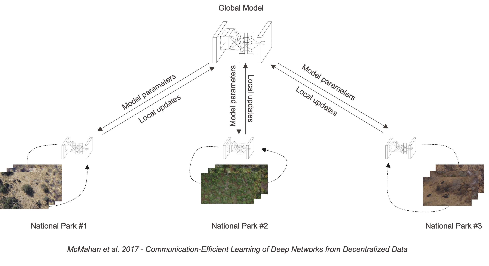

# YOLO4FL - Federated Object Detection



This fork of the official[`ultralytics` computer vision framework](https://docs.ultralytics.com) contains modifications to enable distributed, decentralized training of object detection models according to the [federated learning paradigm](https://arxiv.org/pdf/1602.05629). Implementation- and application details can be found in the paper XY and the corresponding [GitHub repository](https://github.com/gigumay/WildFL/tree/main).

The main branch can be installed via pip install: `git+https://github.com/gigumay/YOLO4FL.git`

To access versions of the framework that can be used within the `MOON` or `FedProto` algorithm, the corresponding branches have to be downloaded. Again, this can be achieved through direct installation with pip:

```
pip install git+https://github.com/gigumay/YOLO4FL.git@MOON
# or
pip install git+https://github.com/gigumay/YOLO4FL.git@FedProto
```

Alternatively, the repository can be installed in editable mode. This allows switching between branches without having to keep separate versions of the package:

```
git clone https://github.com/gigumay/YOLO4FL.git
cd YOLO4FL
pip install -e .
git checkout MOON      # code changes take effect immediately
```

Note that the package will be named  `ultralytics` within the environment it was installed in, according to the repository it was forked from. Below, we list the added functionalities of each branch:


| Branch     | Functionality                                                                                                                                                                                                                                                                                                                                                                                                                                                                                                                                                                                                                                                                                                                                                                                                                                                                                                                |
| ------------ | ------------------------------------------------------------------------------------------------------------------------------------------------------------------------------------------------------------------------------------------------------------------------------------------------------------------------------------------------------------------------------------------------------------------------------------------------------------------------------------------------------------------------------------------------------------------------------------------------------------------------------------------------------------------------------------------------------------------------------------------------------------------------------------------------------------------------------------------------------------------------------------------------------------------------------ |
| `main`     | 1. Loading a set of model weights (a state dict saved as a`.pt` file) at the start of training via the new `state` argument — used to initialize a client's local model with the aggregated global weights at each FL round.                                                                                                                                                                                                                                                                                                                                                                                                                                                                                                                                                                                                                                                                                                |
| `MOON`     | 1.`MOONLoss`: model-contrastive loss from the [MOON paper](https://arxiv.org/abs/2103.16257) is added as a fourth term to the detection loss, controlled by the new `moon` (loss gain) and `tau_moon` (temperature) hyperparameters. <br /> 2. During loss computation, image-level embeddings of the current model are extracted from layers 16, 19, and 22, and contrasted against pre-computed embeddings of the global model (positive pair) and the previous-round local model (negative pair). <br /> 3. Extended data pipeline: per-image embedding files (`<image>_prev.npy` / `<image>_glob.npy`, expected in the labels directory) are verified, cached, and collated into every training/validation batch.  4. Training-time image augmentations are disabled so that batches remain consistent with the pre-computed embeddings.                                                                                 |
| `FedProto` | 1.`TALFeatureExtractor`: extracts object-level feature vectors from the P3/P4/P5 feature maps by mean-pooling all anchors that the task-aligned assigner matched to the same ground-truth object. <br /> 2. Prototype-alignment loss: when `align_prototypes` is enabled, the mean L2 distance between local object features and their closest global prototype (loaded from the file given by `global_obj_protos`) is added as a fourth loss term, weighted by the `ptl` gain. <br /> 3. Feature export for prototype computation: object features can be collected over the training set after training (`features_out_dir_train`) and during validation (`return_features_val`, optionally written to `features_out_dir_val`), e.g., to derive local prototypes for aggregation. <br /><br /><br />Note that the `MOON` and `FedProto` branches also contain the `state`-loading mechanism (functionality 1 of `main`).  |
